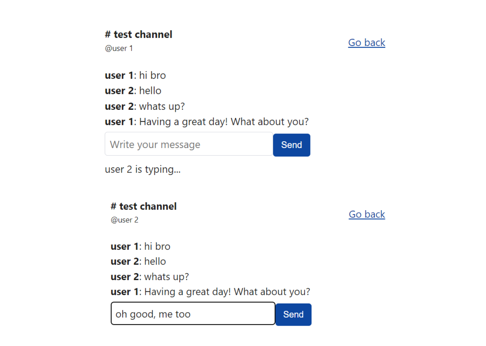

<h1 style="text-align:center">Multichannel app</h1>

######[english]

Imagine that you have to create a socket connection on your frontend application.

This project simulates a multi channel with sockets using socket.io and ReactJS.

To run the API:

>

    yarn dev

To run the frontend:

>

    yarn dev

---

######[português]

Imagine que você tenha que criar uma conexão de socket em sua aplicação frontend.

This project simulates a multi channel with sockets using socket.io.
Este projeto simula multi canais usando com sockets usando socket.io e ReactJS.

Para rodar a API:

>

    yarn dev

Para rodar a frontend:

>

    yarn dev
